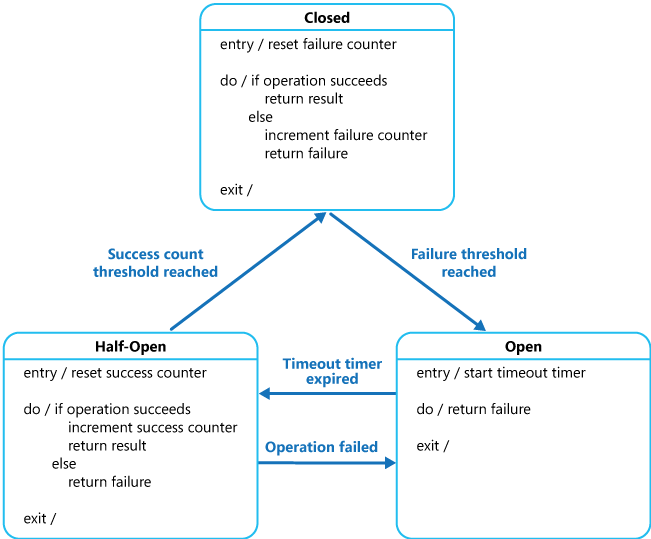

# Circuit breaker

The circuit breaker pattern is a pattern used in a microservice architecture to create resiliency. In a distributed system we have no idea how other components fail.

When external resources fail and the consuming service don't know about this we run into an issue. The calls that are done by the consuming service use the network. This is costly as it consumes more time and can therefore lead to resource exhaustion of the network but also the available threads of the consuming service.

To prevent this resource exhaustion we can implement a circuit breaker which in some way (a proxy, load balancer or code implementation) prevents the calls from being done by the consuming service.

## Implementation

To implement this we define a proxy that monitors the amount of recently failed calls to a downstream service and use this information to determine if the operation should proceed or not. This proxy can be implemented in the same way as an electrical circuit breaker. To implement this we define three different states.

1. **Closed**: The requests are sent to the downstream service and a count is maintained for the failed calls. If the failed calls are exceed a threshold the circuit is placed into the Open state and starts a timer. When the timer expires the circuit goes into the half open state.
2. **Open**: The request from the application fails immediately and an exception is returned to the application.
3. **Half open**: A limited number of requests gets are allowed to pass through and invoke the operation. If these requests are successful, the circuit assumes that the issue has been fixed, and the server assumes

The failure counter for the Closed state is time based, it automatically resets at periodic intervals. The half open state records the number of successfull attempts to invoke the operation. The circuit reverts back to the closed state once a specific number of successful consecutive invocations have occurred.

**Failed operations testing:** In the Open state, rather than using a timer to determine when to switch to the Half-Open state, a circuit breaker can periodically ping the remote service or resource to determine whether it's available. This ping can either attempt to invoke a previously failed operation or use a special health-check operation that the remote service provides. For more information, see Health Endpoint Monitoring pattern.

**Exception handling:** An application that invokes an operation through a circuit breaker must be able to handle the exceptions if the operation is unavailable. Exception management is based on the application. For example, an application might temporarily degrade its functionality, invoke an alternative operation to try to perform the same task or obtain the same data, or report the exception to the user and ask them to try again later.

**Failed request replay:** In the Open state, rather than simply failing quickly, a circuit breaker can also record the details of each request to a journal and arrange for these requests to be replayed when the remote resource or service becomes available.

## Resources

1. [Circuit Breaker Pattern (Design Patterns for Microservices) - Medium](https://medium.com/geekculture/design-patterns-for-microservices-circuit-breaker-pattern-276249ffab33)
2. [Circuit Breaker Pattern - Microsoft](https://learn.microsoft.com/en-us/azure/architecture/patterns/circuit-breaker)
