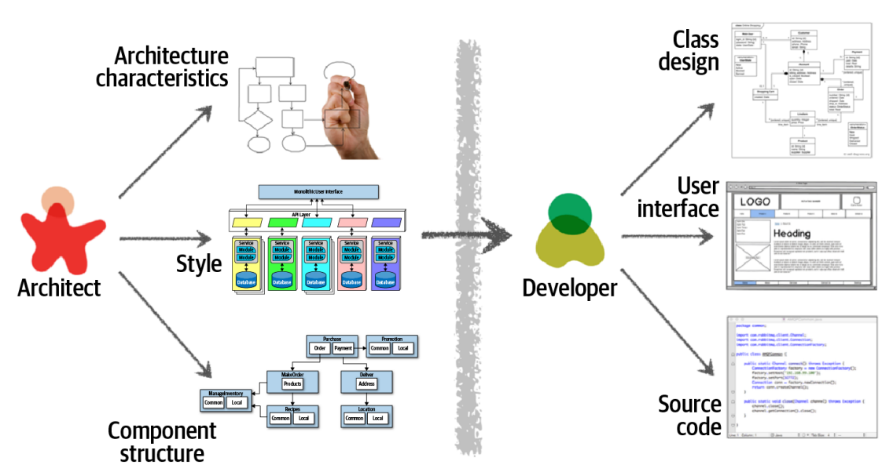
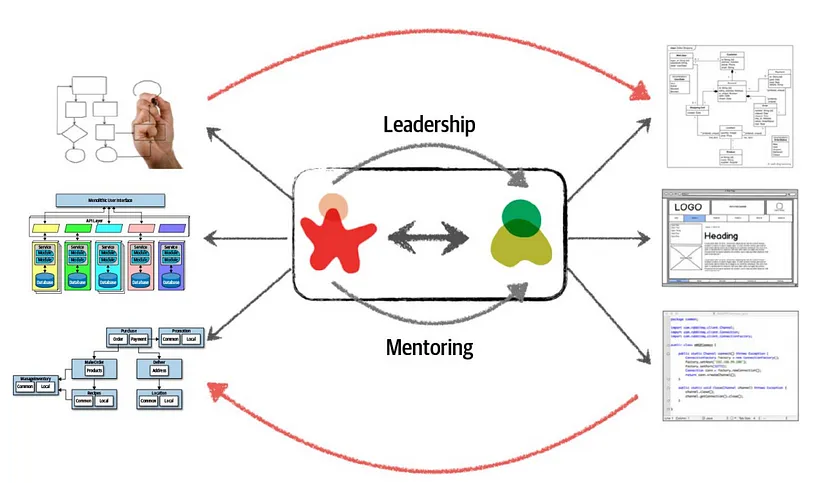
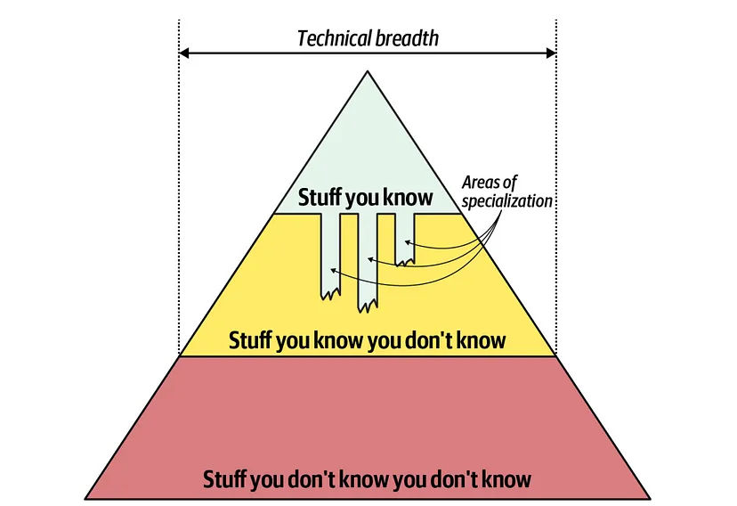

# Architectural Thinking (p. 23-36 Fundamentals of Software Architecture)

Architectural thinking focuses around seeing things with an 
architectural eye or an architectural point of view. There 
are four main aspects of thinking like an architect.
1. Understanding the difference between architecture and 
design and knowing how to collaborate with development teams 
to make architecture work.
2. Having a wide breadth of technical knowledge while still
maintaining a certain level of technical depth, allowing
the architect to see solutions and possibilities that others
do not see.
3. Understanding and analyzing and reconciling trade-offs
between various trade-offs between various solutions and
technologies.
4. Understanding the importance of business drivers and 
how they translate to architectural concerns.

## Architecture vs Design (p. 23-25)
In this chapter the writer argues that a software 
architect in the traditional sense rarely works. As you
in the image below the architect is responsible for
extracting the architecture characteristics, the architecture
patterns and styles and the components. These together form
the building blocks of the application after which they
are handed of to the development team.

[//]: # (

)

This mostly does not work because of the unidirectional
flow of information. Decisions the software architect 
might make will never reach the developers and
decisions the developers make might never reach the 
architect. This results in the architect and the development
team being disconnected from each other.

For architecture to work properly this "unidirectional flow"
must be broken down and become bidirectional. This in actuality
that the architect is part of the development team as well and
provides mentoring and coaching to developers on the team.
See the image below.

[//]: # (

)

## Technical Breadth (p. 25-30)
In contrast to a developer a software architect is deemed
to have a broad understanding of the different technologies
there are and how they are best employed. This is called
technical breadth. Whereas a developer has a lot of knowledge
about a language of the framework they work with.

In the book the writer talks about three levels of knowledge
or the so-called pyramid of knowledge. This pyramid represents
the knowledge. 

[//]: # (

)

As you can see in the image above it consists of three layers:
1. Stuff you know, this is the stuff you know you know, The 
framework you work in or the language you work in most.
2. Stuff you know you don't know, this is the knowledge you
know you dont posess.
3. Lastly there is the stuff you don't know you don't know,
these are the things you don't know you don't know, things
that can come upon you're path where you never knew it existed
or was a possibility.

It is important to note that stuff you know is also
stuff you are supposed to maintain and keep up to date.

Looking at this pyramid we can see several things, by 
expanding the pyramid sideways along the x-axis we
work on technical breadth, meaning that we work on
having a broader understanding of tools and the right
applications for the tools.

If we expand along the y-axis we work on technical depth
by gathering more knowledge in the stuff you know part
you expand your technical depth however this is also
knowledge you need to maintain.

Lastly you can see that there is an element bleeding
into the stuff you know you don't know, these are 
areas of specialization.

This pyramid illustrates how fundamentally different the
role of an architect compares to that of a developer.
Developers focus on honing their expertise. Transitioning
to the architect role means a shift in that perspective.

