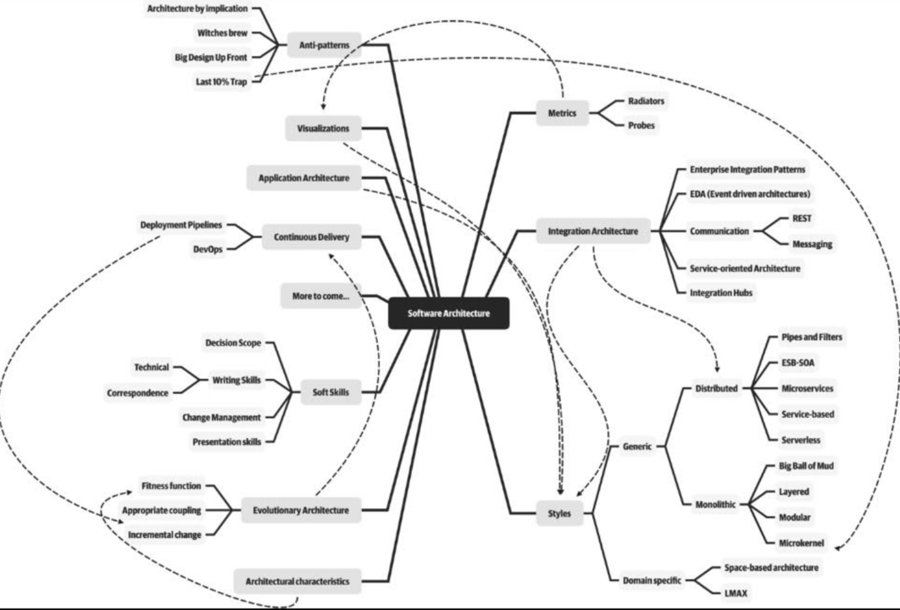

# Introduction (p. 1-19 Fundamentals of Software Architecture)

[//]: # (

)

in this introduction some key concepts of software architecture 
will be introduced. Beneath there is an outline of the different
subjects discussed in this introduction.

- [Definition of software architecture](#definition-of-software-architecture-p-3-8)
- [Expectations of an architect](#expectations-of-an-architect-p-8-13)

## Definition of software architecture (p. 3-8)
A way of illustrating how a software architect should think about
software architecture consists of four foundations.

1. Architecture characteristics
2. Structure
3. Architecture decisions
4. Design principles

### Structure (p. 5)
The structure in these four foundations refers to the type of
architecture style(s) the system is implemented in. These can
range from microservices to layered structures.
Describing the architecture solely by the structure does not 
fully qualify to describe the intricacies of the complete
architecture.

### Characteristics (p. 6)
Architecture characteristics are another dimension of defining
software architecture. These characteristics define the success
criteria of a system. The characteristics listed below do not 
require knowledge of the functionality of the system, yet 
they are required for the system to function properly.

| <!-- -->        | <!-- -->      | <!-- -->       |
|-----------------|---------------|----------------|
| Availability    | Reliability   | Testability    |
| Scalability     | Security      | Agility        |
| Fault tolerance | Elasticity    | Recoverability |
| Performance     | Deployability | Learnability   |

### Architecture decisions (p. 6-7)
Architecture decisions define the rules for how a system should 
be constructed. An architect might make decisions that only the 
business layer and services layer in a layered architecture are
allowed to make calls to the database. Therefore, we can state 
that architecture decisions form the constraints of the system 
and direct the development teams on what is and isn't allowed.

If a particular architecture decision can't be implemented then 
that decision or rule can be broken through something called a 
variance.

### Design Principles (p. 7-8)
A design principle in the context of software architecture is a 
guideline that can be used to provide guidance for the preferred 
way to implement.

## Expectations of an Architect (p. 8-13)
Defining the role of an architect is difficult therefore, it is
recommended to focus on the expectations of an architect. There
are eight core expectations placed on a software architect:

- Make architecture decisions
- Continually analyze the architecture
- Keep current with latest trends
- Ensure compliance with decisions
- Diverse exposure and experience
- Have business domain knowledge
- Possess interpersonal skills
- Understand and navigate politics

### Make architecture decisions (p. 9)
*An architect is expected to define the architecture decisions
and design principles used to guide technology decisions within
the team, the department, or across the enterprise.*

The key word in this sentence is guide. This means that it is 
the job of the architect to not decide how and what technology
should be implemented. The architect should merely guide and 
let the team decide what technologies to implement to best suit
the architecture envisioned. The key to making effective 
architectural decisions is asking whether the architecture 
decision is helping to *guide* teams in making the right
technical choice for them.

That said, an architect on occasion might need to make specific
technology decisions in order to preserve an architectural 
**characteristic**.

### Continually Analyze the Architecture
*An architect is expected to continually analyze the architecture
and current technology environment and then recommend solutions 
for improvement.*

This expectation relates to architecture vitality, which assesses
how viable the architecture still is today. This happens when 
developers make coding or design changes that impact the required 
architectural characteristics. This will in turn impact the overall
agility for code modification. This means that if it takes weeks
for teams to test changes and months for releases, then architects
cannot achieve agility in the overall architecture.

### Keep Current with Latest Trends
*An architect is expected to keep current with the latest technology
industry trends.*

In contrast to developers an architect needs to keep current
on the latest technical and industry trends. The decisions that are
made by an architect tend to be long-lasting and difficult to
change.

### Ensure Compliance with Decisions
*An architect is expected to ensure compliance with architecture
decisions and design principles.*

Ensuring compliance means that the architect is continually 
verifying that development teams are following the architecture 
decisions and design principles defined, documented and communicated 
by the architect.

### Diverse Exposure and Experience
*An architect is expected to have exposure to multiple and diverse
technologies, frameworks, platforms and environments.*

An architect is required to have knowledge of a broad spectrum of
technologies. Here the focus lies in technical breadth instead of
technical depth. As an example it is more beneficial for an 
architect to be familiar with 10 caching products, knowing their 
associated pros, than to be an expert in only one.

### Have Business Domain Knowledge
*An architect is expected to have a certain level of business domain
expertise*

Without business domain knowledge, it is difficult to understand
the business problem, goals, and requirements, making it difficult
to design an effective architecture to meet the requirements of the
business. Therefore, it is of crucial importance that an architect 
can effectively communicate with C-level executives and business
user.

### Possess Interpersonal Skills
*An architect is expected to possess exceptional interpersonal
skills, including teamwork, facilitation, and leadership.*

An architect is expected to lead the development team through 
the implementation of the architecture. Leadership skills are
at least half of what it takes to become an effective software
architect.

### Understand and Navigate Politics
*An architect is expected to understand the political climate
of the enterprise and be able to navigate the politics.*

It is important for an architect to understand politics. This
is mostly because the decisions an architect makes have impact
on the organization therefore those decisions will be challenged
by product owners, project managers, and business stakeholders
due to increased cost or increased effort (time) involved. Besides
that the architectural decisions will also be challenged by
developers who feel their approach is better.